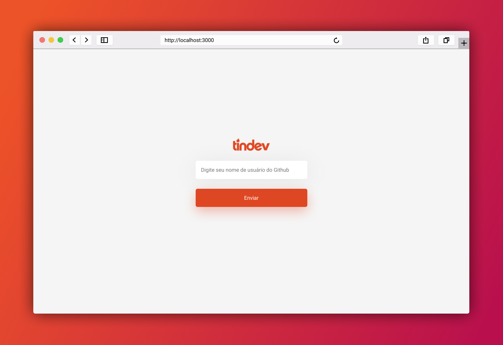
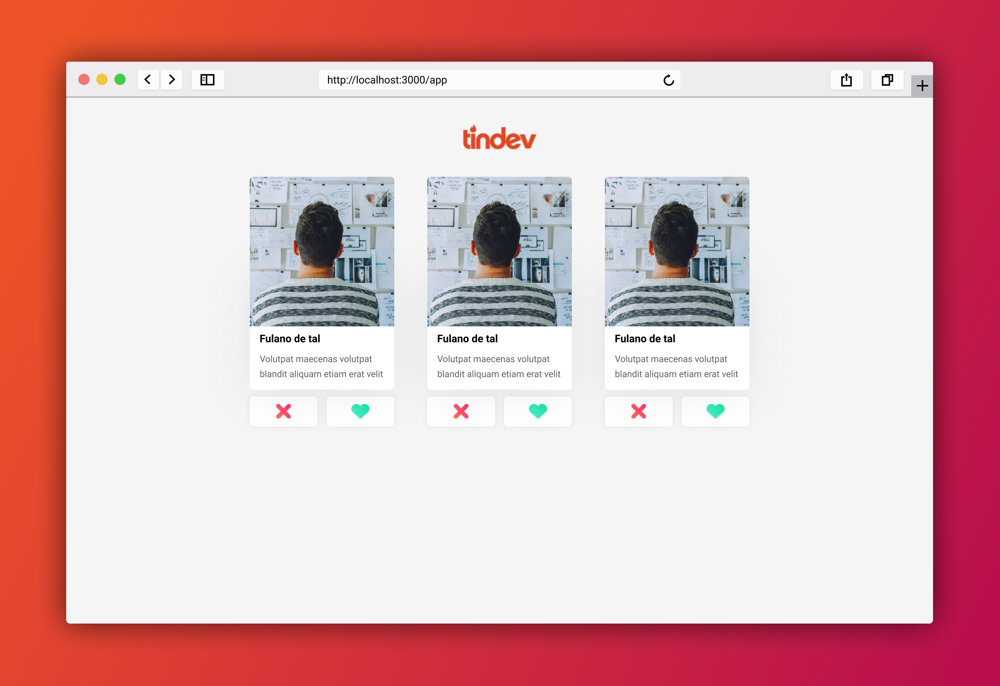
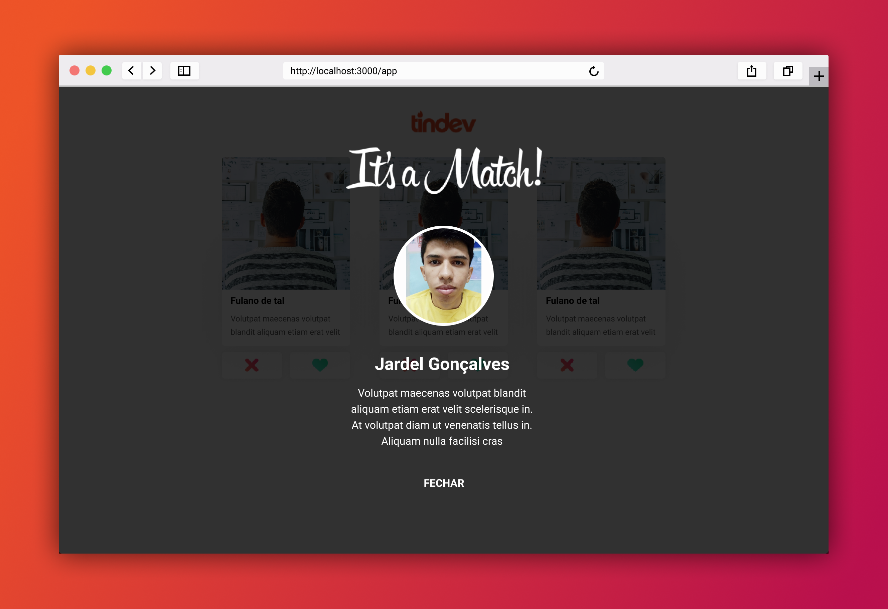

# Tindev
Projeto desenvolvido na Semana Omnistack 8.0

## Protótipos
### Mobile
<p align="center">
  
</p>

### Web
<p align="center">
  
</p>

<p align="center">
  
</p>

<p align="center">
  
</p>

## Executando projeto

### Rest API
Este projeto se encontra no diretório `backend` e neste projeto foi utilizado o [Mongodb Atlas](https://www.mongodb.com/cloud/atlas) (nuvem que fornece 500mb free).

Antes de colocar a API para rodar, precisamos configurar a URL de conexão do mongodb e para isso,
altere o nome do arquivo `.env.example` para `.env` e adicione a URL de conexão do mongodb no arquivo entre "" (aspas duplas), veja um exemplo usando o Mongodb Atlas:
```
MONGO_URL="mongodb+srv://<seu usuario>:<Senha do usuario>@cluster-xxxx.mongodb.net/tindev?retryWrites=true&w=majority"
```
Lembre-se de remover os sinais de `<` e `>` ao adicionar o usuario e a senha. Além disso, essa URL é fornecida pelo Mongodb Atlas.

Feito isso basta executar esses comandos no diretório `backend` para rodar a API
```
# Instalando as dependencias
yarn install

# Rodando API
yarn start
```

### Web
O projeto web se encontra no diretório `frontend` e para rodar o projeto,
basta executar os seguintes comandos no diretório citado anteriormente:
```
# Instalando dependencias
yarn install

# Rodando projeto
yarn start

```

### Mobile
Para a instalação e configuração do ambiente com React Native, acesse tutorial
[clique aqui](https://docs.rocketseat.dev/ambiente-react-native/introducao)

Após a instalação e configuração do ambiente, deixe o emulador em execução conectado ao [adb](https://developer.android.com/studio/command-line/adb?hl=pt-br)
e execute os seguintes comandos no diretório `mobile`

```
# Instalação das dependencias
yarn install

# Compilando a primeira vez o app (para android, caso seja para iOS troque o android por ios)
react-native run-android

# executando o projeto
react-native start
```
Após os passos acima, basta dar reload na aplicação mobile no emulador (para android aperte `r` duas vezes)
